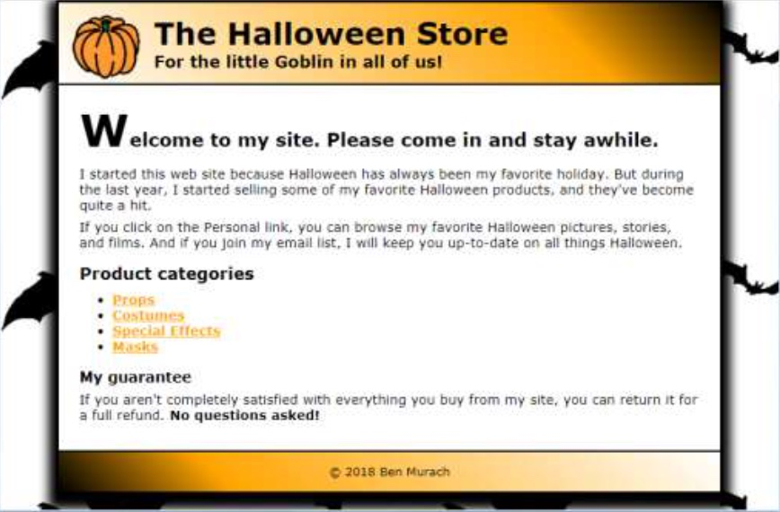

# Halloween Project - Chapter 5 

## Directions

### Partner 1
- In the html footer, add both partners names.
- In the HTML file:
  - Wrap a single `
` element around the `<header>`, `<main>`, and `<footer>`. Give it an id attribute set to `container`.
- In the CSS file:
  - Format the container so it's 800 pixels wide, centered in the browser window, has a white background, and has a black border with a shadow.
  - Add a halloween background image to the body. Either find a graphic online or use the `bats.gif` file in the `images` folder.

### Partner 2
- In the CSS file:
  - Add a black border below the header and above the footer.
  - Remove the text shadow, italics, and orange color from the `header h2` selector.
  - Add a 45 degree gradient to the header and footer. 
    - In the header start with white on the left, orange 3/4 of the way to the right, and black at the right. 
    - In the footer start with black on the left, orange 1/4 of the way to the right, and white at the right.
  - Adjust margin and padding to any element as needed so the page looks as shown below.
- Run the code through the [CSS validator](https://jigsaw.w3.org/css-validator/). Fix any errors or warnings. 
- Send a link of the live website for grading.

## Goal

